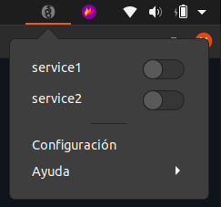
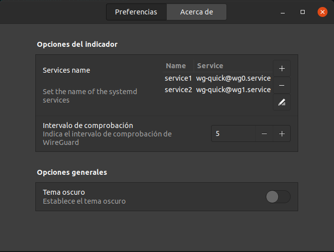

<!-- start project-info -->
<!--
project_title: WireGuard Indicator
github_project: https://github.com/atareao/wireguard-indicator
license: MIT
icon: /datos/Sync/Programacion/gnome-shell/wireguard-indicator@atareao.es/icons/wireguard-icon.svg
homepage: https://www.atareao.es/aplicacion/wireguard-indicator
license-badge: True
contributors-badge: True
lastcommit-badge: True
codefactor-badge: True
--->

<!-- end project-info -->

<!-- start badges -->


[](https://www.codefactor.io/repository/github/atareao/wireguard-indicator/overview/master)
<!-- end badges -->

<!-- start description -->
<h1 align="center">Welcome to <span id="project_title">WireGuard Indicator</span> 👋</h1>
<p>
<a href="https://www.atareao.es/aplicacion/wireguard-indicator" id="homepage" rel="nofollow">

</a>
</p>
<h2>🏠 <a href="https://www.atareao.es/aplicacion/wireguard-indicator" id="homepage">Homepage</a></h2>
<p><span id="project_title">WireGuard Indicator</span> is an indicator to show the status of your WireGuard VPN.</p>
<p>WireGuard Indicator can enable and disable the WireGuard VPN by clicking on it.</p>
<p>You need becomes root</p>

<!-- end description -->

<!-- start prerequisites -->
## Prerequisites

You need WireGuard. To install it, simply,

```
sudo apt install wireguard
```

Of course, you need to configure your loved WireGuard.

<!-- end prerequisites -->

<!-- start installing -->
## Installing <span id="project_title">WireGuard Indicator</span>

To install <span id="project_title">WireGuard Indicator</span>, follow these steps:

Goto [GNOME Extensions page](https://extensions.gnome.org/) and search for WireGuard Indicator.

Enable the extension by click the switch.

<!-- end installing -->

## Setting Up

<span id="project_title">WireGuard Indicator</span> provide two ways to connect to your wireguard vpn:

-   nmcli
  With `nmcli` we need to add our `wg.conf` file connection first by `sudo nmcli connection import type wireguard file /path/to/your/your-wg-file.conf`, since <span id="project_title">WireGuard Indicator</span> pick up the connection of `type=wireguard` they'll show up on the drop down and toggled right away after import (note: you may want to disable the auto connect via `nm-connection-editor` or your distro network setting).

-   systemd
  Add wireguard to systemd by running `sudo systemctl enable wg-quick@yourconfig.service`, make sure you have your `/etc/wireguard/config.conf` in place.

<!-- start using -->
## Using <span id="project_title">WireGuard Indicator</span>

When you start **<span id="project_title">WireGuard Indicator</span>** it goes to Indicator Area, as you can see in the next screenshot,



In this screenshot, the language is Spanish, but, if there is no translation for your language, you will find the app in English.

If you click to enable WireGuard, a dialog appears to ask you for your password to gain root rights.


You can set some options as you can see in next screenshot



* Enable the dark theme for the WireGuard Indicator icon


* Set the systemd service name
* Set the check time

<!-- end using -->

<!-- start contributing -->
## Contributing to <span id="project_title">WireGuard Indicator</span>

To contribute to **<span id="project_title">WireGuard Indicator</span>**, follow these steps:

1. Fork this repository.
2. Create a branch: `git checkout -b <branch_name>`.
3. Make your changes and commit them: `git commit -m '<commit_message>'`
4. Push to the original branch: `git push origin atareao/readmemaker`
5. Create the pull request.

Alternatively see the GitHub documentation on [creating a pull request](https://help.github.com/en/github/collaborating-with-issues-and-pull-requests/creating-a-pull-request).
</commit_message></branch_name>


<!-- end contributing -->

<!-- start contributors -->
## 👤 Contributors ✨

Thanks goes to these wonderful people ([emoji key](https://allcontributors.org/docs/en/emoji-key)):


<!-- end contributors -->

<!-- start table-contributors -->

<table id="contributors">
	<tr id="info_avatar">
		<td id="atareao" align="center">
			<a href="https://github.com/atareao">
				
			</a>
		</td>
		<td id="dtalens" align="center">
			<a href="https://github.com/dtalens">
				
			</a>
		</td>
	</tr>
	<tr id="info_name">
		<td id="atareao" align="center">
			<a href="https://github.com/atareao">
				<strong>Lorenzo Carbonell</strong>
			</a>
		</td>
		<td id="dtalens" align="center">
			<a href="https://github.com/dtalens">
				<strong>dtalens</strong>
			</a>
		</td>
	</tr>
	<tr id="info_commit">
		<td id="atareao" align="center">
			<a href="/commits?author=atareao">
				<span id="role">💻</span>
			</a>
		</td>
		<td id="dtalens" align="center">
			<a href="/commits?author=dtalens">
				<span id="role">🌍</span>
			</a>
		</td>
	</tr>
</table>
<!-- end table-contributors -->
